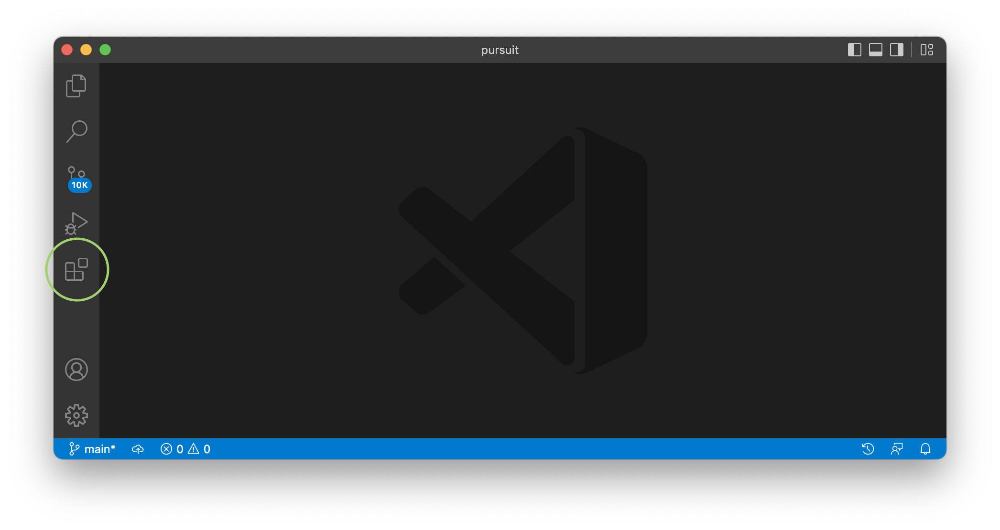
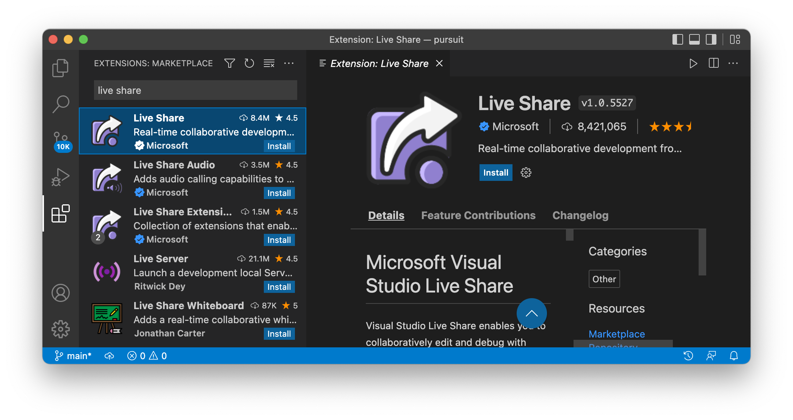

# Local environment

The following installations will make it possible for you to develop all kinds of applications on your computer. For each of the following installations, follow the instructions in this document or on the provided website as closely as possible.

Installing these tools can be frustrating if you miss a single step or if the application has received an update that is not captured in the instructions. As always, reach out to your instructor if you get stuck.

### iTerm2

While the Terminal that comes with Mac OS X is useful as is, you'll find many developers have upgraded to use iTerm2. There are many features iTerm provides which goes above and beyond the typical Terminal program.

Download the latest stable version of iTerm. Unzip the download and then drag the downloaded icon into your Applications folder. _You should not leave the application icon in your Downloads folder._

- [Download link](https://iterm2.com/downloads.html)

> **Note:** You can interchange the terms iTerm2, iTerm, and terminal moving forward.

To open iTerm, you can either navigate to the Applications folder on your machine or open up Spotlight by clicking <kbd>command</kbd> + <kbd>space</kbd> and then typing "iterm".

When you open iTerm for the first time, you may be prompted to install `pip3` or install some command line developer tools. You should accept these installations. These installations can take some time.

Once this installation finishes, you should see your prompt. The word "prompt" refers to a place in your terminal program where you can clearly type. You are now ready to use your terminal program.

You will be using iTerm2 quite a lot. You may want to add it to your Mac's dock. To do so, right-click on the icon in the dock. Then, select "Options".


Finally, select the option that says "Keep in Dock".

### Install the Homebrew package manager

Now that your terminal is setup, it's time to install Homebrew, the de facto package manager for OS X. If you've never heard of a package manager, think of it as an app store for free command line programs.

To install Homebrew, first visit the website.

- [Homebrew homepage](https://brew.sh/)

You will see a line of text that you are able to copy underneath the text "Install Homebrew." Copy and paste that command _from the website_ into your terminal window.


After running this command, you may see the following text in your terminal window:

```
==> Checking for `sudo` access (which may request your password)...
Password:
```

This means you need to enter the password _to your computer._ Type in your password now. Note that you _will not_ see any text appear on the screen while you type.

After your password is entered correctly, the terminal window will show some text and then stop once again, asking whether or not it is allowed to create new directories. Press the <kbd>return</kbd> key to accept these changes.

Homebrew will then begin to install. Leave the terminal alone until you see the prompt once again. A few steps will have been shown right above your prompt. These will look similar to the following image, although the user name should be different.


Copy and paste both of these commands into your terminal. Once that is done, copy and paste the following into your terminal and press the <kbd>return</kbd> key.

```
brew --version
```

You should then see the Homebrew version number.

### Updating your software

Macs require that you install some special tooling to work with their system. To install this, run the following command in your terminal.

```
softwareupdate --all --install --force
```

When you do this, you will see text appear in your terminal that will say something like "Downloading Command Line Tools for Xcode". You should leave your terminal running until your prompt returns.

> **Note:** This may take some time! Be patient and allow the installation to fully finish.

### Installing Oh My Zsh

On its own, the terminal is relatively boring looking. One way to improve the look of it is with Oh My Zsh, commonly shortened to Zsh or `zsh`. Visit the Oh My Zsh website and then scroll down to the installation script.

- [Oh My Zsh homepage](https://ohmyz.sh/)

The script will have a `$` symbol in front of it but _you should not copy that symbol._ That symbol represents the beginning of the prompt. Instead, copy everything _after the `$` symbol_ and paste it into your terminal.


When the installation has finished, you will see that your prompt has changed! It should now include some colors and an arrow.


The `zsh` program is now installed. In just a bit, you will see how Zsh can improve your experience in the terminal.

#### Troubleshooting problems with Zsh

When you reopen your terminal after having closed it, you may receive the following error:

```
Insecure completion-dependent directories detected:
```

If this is the case, run the following command. Then, close and reopen your terminal program.

```
compaudit | xargs chmod g-w,o-w
```

If that doesn't fix the problem, work with your instructor to figure out the issue. The following [Stack Overflow answer](https://stackoverflow.com/questions/61433167/zsh-detects-insecure-completion-dependent-directories/61433333#61433333) may be of use.

### Install NodeJS

Using Homebrew, you can also install Node, an open-source, cross-platform runtime system for developing applications in JavaScript. In other words, it runs JavaScript outside the browser.

To get started, run the following command.

```
brew install node
```

Once it finishes, run the following command.

```
node -v
```

You should then see a version number for the `node` command.

### Git

Git is a version control system that allows for tracking changes within a directory. When we installed Homebrew, it should have installed the `git` command. To verify, type the following into the terminal:

```
git --version
```

You should then see a version number for the `git` command.

### Visual Studio Code (VSCode)

[Visual Studio Code](https://code.visualstudio.com/) is a code editor that allows you to write and run code. Developers rarely use tools like Replit when working on a large project. Instead, they use tools like VSCode for many of their code-writing needs.

While it's possible to download VSCode directly, you can also download it via Homebrew. On the command line, run the following command.

```
brew install visual-studio-code
```

This installation will take a bit of time. Once it's complete, you should be able to run the following command which will open up VSCode.

```
code .
```

You may receive a few messages asking if VSCode can have access to a variety of folders. You should allow VSCode to have this access. You are now ready to start editing your code!

#### Updating your Zsh theme

Among other features, Zsh allows you to edit the look and feel of your terminal. Close VSCode and then go to your terminal. Then, run the following command.

```
code ~/.zshrc
```

This will open up a configuration file for Zsh in VSCode. At the top of the file, you should see the following line:

```
ZSH_THEME="robbyrussell"
```

This is the default theme for Zsh. Instead, change it to the following:

```
ZSH_THEME="clean"
```

Save the file and then return to your open terminal program. At the moment, nothing will have changed. Close the terminal program and then reopen it. You should now see that your theme is slightly different.

Try changing your theme once again by repeating the steps above but replacing `"clean"` with `"ys"`. Close your terminal and then reopen it. Once again, you should see a different look for your terminal!

For the beginning of the program, choose either of these two themes. When you become more comfortable with the command line, you are welcome to change it up to a different theme of your choosing.

#### Install extensions

VSCode allows for the installation of extensions. These extensions are similar to browser plugins or apps you install on your phone. While there are many extensions that can be useful, there is only one you need to install right now.

Open VSCode and click on the icon on the left that looks like a series of blocks.



After clicking it, you will see a search bar at the top. Type "live share" into that search bar. You will then select the option that shows it was created by Microsoft.



Click the Install button. You may be prompted to restart VSCode after the installation has finished.

Live Share allows you to share what's happening inside of your VSCode with other developers who are using VSCode. For more information, you can visit the following link.

- [Microsoft: Install and sign in to Live Share in Visual Studio Code](https://docs.microsoft.com/en-us/visualstudio/liveshare/use/install-live-share-visual-studio-code)

Your instructors will let you know whether or not you will be using Live Share in your classroom.
